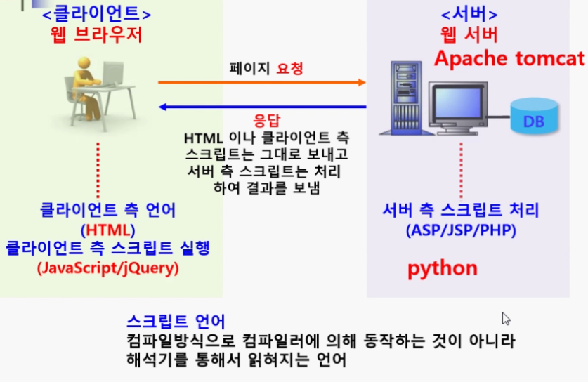
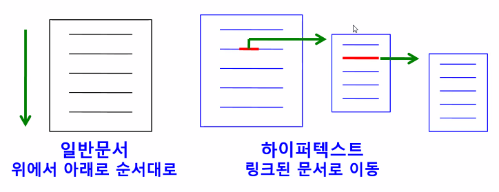
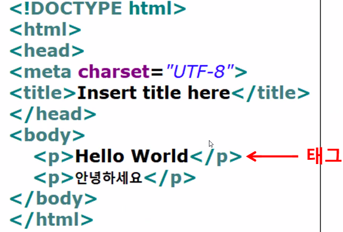

## 웹 동작 구조

## Hyper Text

- 문서간에 서로 링크가 설정해서 클릭해서 해당 문서로 이동하는 기능

## HTTP

- Hyper Text Transfet Protocol
- 인터넷 통신 규약

---

## HTML

- Hyper Text Markup Language

- 웹브라우저에서 하이퍼텍스트 기능을 구현하는 웹 페이지 작성 언어
- HTML 문서는 태라는 명령어로 출력하고자 하는 내용을 출력

---

## Tag

- HTML에서 사용하는 명령어
- 원하는 모양과 형태로 브라우저에게 명령을 내림

## URL

- Uniform Resource Locator
- 인터넷 주소