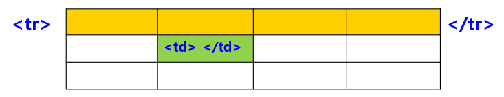
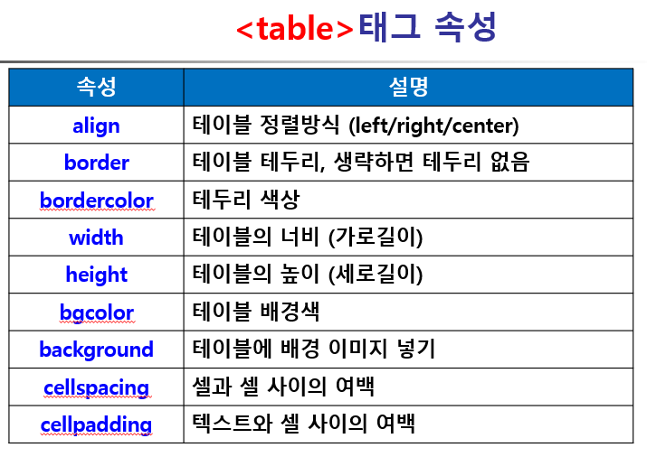

## 테이블 태크







## HTML 테이블 코드

```html
  <table border="1"> <!-- 테이블 정의 -->
    <caption>테이블2</caption> <!-- 표 제목 설정 -->
    <thead align="center"> <!-- 테이블 내용 모두 가운데 정리 -->
    <tr><th>a</th><th>b</th><th>c</th><th>d</th></tr>  <!-- 5행 4열-->  <!--td대신 th로 제목 표시 가능-->
    <tr><td rowspan="3">a1</td><td>b1</td><td>c1</td><td>d1</td></tr> <!-- a2/a3 합치기 해당 내용을 삭제해줘야 함-->
    <tr><td>b2</td><td>c2</td><td>d2</td></tr>
    <tr><td>b3</td><td>c3</td><td>d3</td></tr>
    <tr><td>a4</td><td>b4</td><td colspan="2">c4</td></tr>
    </thead>
  </table>

```

